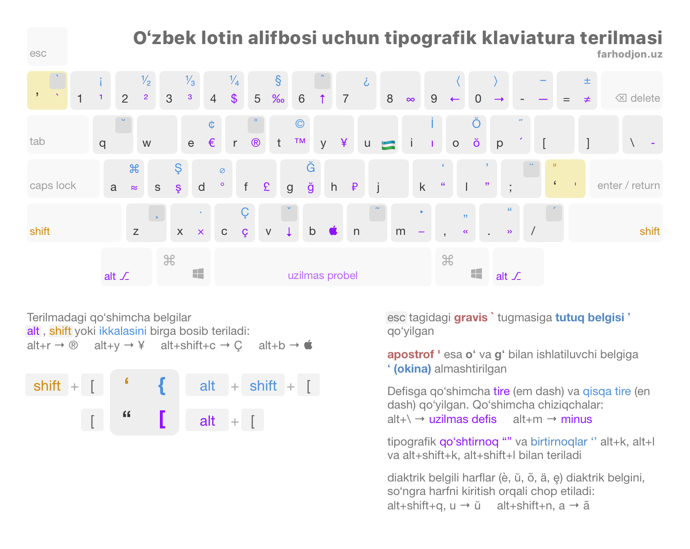
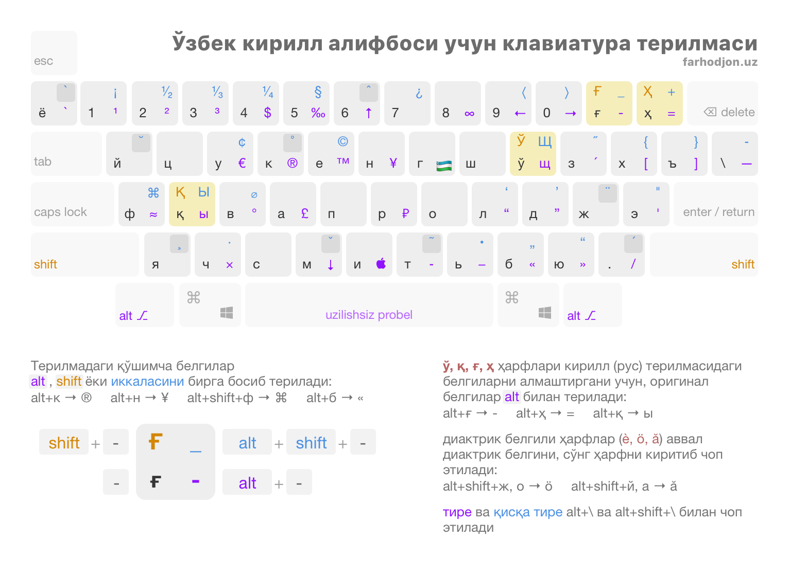

# Oʻzbekcha tipografik klaviatura terilmalari

Ushbu klaviatura terilmalari [Ilya Birmanning tipografik terilmasi](https://ilyabirman.ru/projects/typography-layout/) asosida yaratilgan. Imkoni boricha original va Birman sxemasidagi belgilar saqlab qolingan.

Ushbu klaviatura terilmalari oʻzbekcha alifbolardagi harflar va belgilarni Ilya Birman tipografik terilmasi bilan birlashtiradi. Ilya Birman terilmasi turli maxsus belgilarni oson kiritish imkoniyatini beradi. Masalan, Alt va < orqali « belgisini terish mumkin.

# Yangi terilmalar qilish yoki oʻzgartirish

Terilmalarning oʻzgartirish mumkin boʻlgan fayllari `source` papkasi ichida. macOS va Windows uchun qilingan terilmalar faqat shu tizimlardagina oʻzgartirilishi mumkin.

Quyida keltirilgan terilma dizayni `source/layouts.sketch` faylida ([Sketch](https://www.sketch.com) dasturi kerak boʻladi).

## macOS

1. [Ukelele](https://software.sil.org/ukelele/) dasturini oʻrnating.
2. Ukelele orqali `source/macOS/Uzbek Typography Layouts.bundle` faylini oching.
3. Zarur oʻzgarishlarni qilib, shu dasturning oʻzidan terilmani tizimga oʻrnatish yoki reliz sifatida `DMG` faylga eksport qilish mumkin.

macOS menyu panelida chiqadigan ikonkalar uchun `source/macOS/latin-layout-icon.icns` va `source/macOS/cyrillic-layout-icon.icns` fayllari ishlatiladi.

## Windows

1. [Microsoft Keyboard Layout Creator](https://www.microsoft.com/en-us/download/details.aspx?id=102134) dasturini oʻrnating.
2. `source/Windows` papkasi ichidagi zarur fayl (qaysi terilma kerakligiga qarab) shu dastur orqali ochiladi.
3. Reliz eksport qilinganda dastur yangi papka yaratadi va uning ichidagi `setup.exe` faylini ishga tushirish orqali terilmani oʻrnatish mumkin.

# Terilmalar haqida
## Lotin alifbosi

Ushbu terilmada asosiy eʼtibor qaratilgan:

- Oʻ va Gʻ harflari uchun ishlatiladigan [ʻOkina](https://en.wikipedia.org/wiki/ʻOkina) (*modifier letter turned comma*) belgisi apostrof oʻrniga qoʻyilgan: bu belgi tipografik tomondan birtirnoqdan koʻra toʻgʻri: tinish belgisimas va soʻzni boʻlmaydi;
- tutuq belgisi uchun qoʻllaniladign modifikator apostrof (*[modifier letter apostrophe](https://en.wikipedia.org/wiki/Modifier_letter_apostrophe)*) “gravis” oʻrniga qoʻyilgan (`esc` tagiga): bu belgi ham yuqoridagi kabi tipografik tomondan toʻgʻri;
- ushbu terilma 1993-yildagi oʻzbek va hozirgi turk, ozarbayjon, turkman alifbolarida ishlatiladigan harflarni ham oʻz ichiga olgan: **Ŏ**, **Ğ**, **Ş**, **Ç**, **İ** (`alt` bilan teriladi).

Qolgan barcha oʻzgarishlar quyidagi illyustratsiyada keltirilgan:

## Kirill alifbosi

Ushbu terilma kirill alifbosi uchun yechadigan muammolari:

- macOS uchun bunaqa terilma umuman mavjud emas;
- **Ғ** va **Ҳ** harflari `-`, `_`, `+`, `=` belgilarni qulay terish imkoniyatini bermaydi, [qiyin](https://twitter.com/FarLives/status/1046011620516929536); ushbu terilma esa `alt` orqali ularni terish imkoniyatini beradi;
- **Ў** va **Қ** harflari almashtirgan ruscha harflarni ham yuqoridagi kabi terish mumkin;

# Oʻrnatish

## macOS

1. Yuklab oling: [uzbek-typography-layouts-macOS.dmg](https://github.com/farhodjon/uzbek-typography-layouts/releases/latest/download/uzbek-typography-layouts-macOS.dmg)
2. Yuklab olingan faylini oching.
3. `Uzbek Keyboard Layouts.bundle` faylini `Drag here to install` nomli yorliqqa yuboring (faylni sudrab yorliq ustiga tashlaysiz).
4. *System Preferences* ichidan *Keyboard → Input Sources* ekraniga oʻtasiz.
5. `+` tugmasini bosib roʻyxatdan yangi terilmalarni qoʻshasiz (xuddi boshqa terilmalarni qoʻshgandek). Ushbu terilmalar roʻyxatda oʻzbek tili sifatida chiqadi.

## Windows

1. Yuklab oling: [uzbek-typography-layouts-windows.zip](https://github.com/farhodjon/uzbek-typography-layouts/releases/latest/download/uzbek-typography-layouts-windows.zip)
2. Arxivni ochganingizdan soʻng ikkita papka paydo boʻladi: *uzbek-cyrillic-typography-layout-2.0* va *uzbek-latin-typography-layout-2.0*.
3. Mos papkaga kirib `setup.exe` faylini ishga tushirasiz.
4. Kompyuterni oʻchirib=yoqish talab qilishi mumkin.